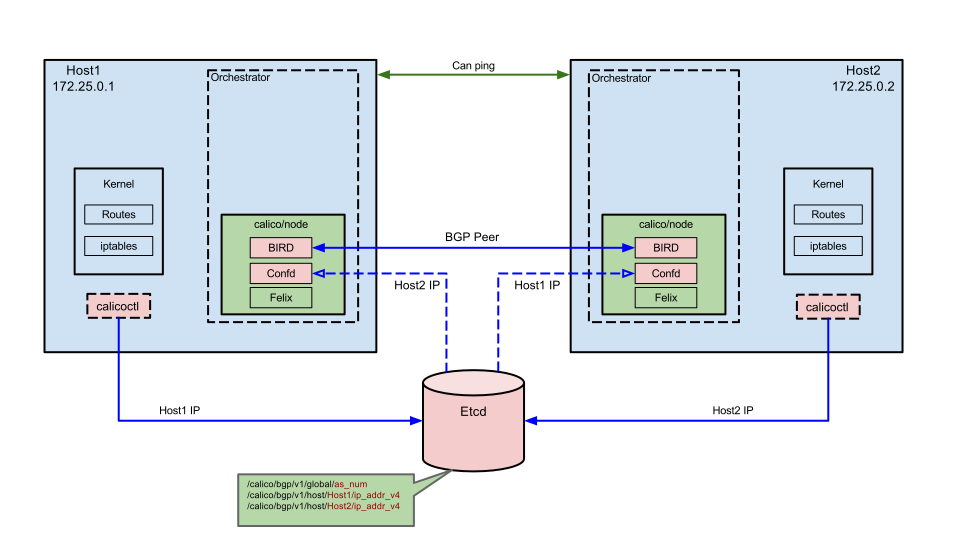
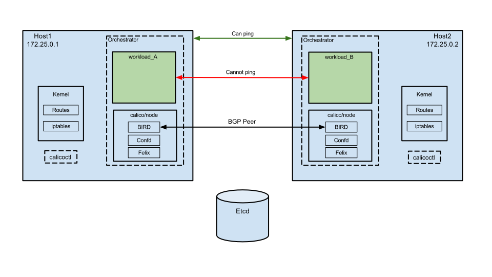
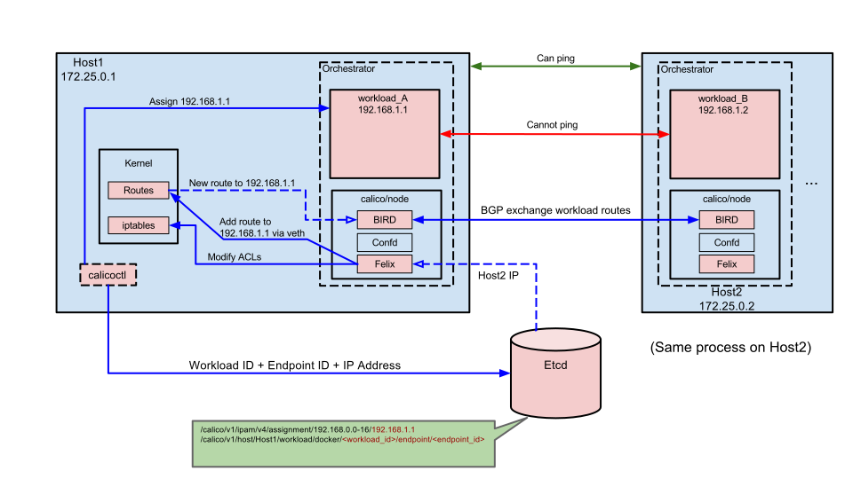
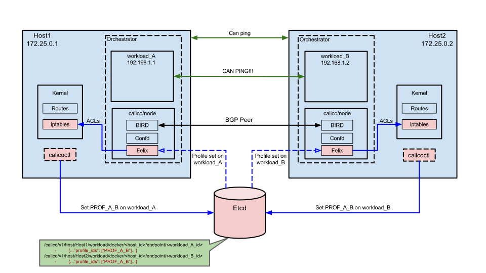

# Calico networking in a containerized environment

This GitHub repository is the entry point for running a Calico network in a
containerized environment.

The `calico-docker` repository allows users to easily configure endpoints and 
network policy with the `calicoctl` command line tool. `calico-docker` utilizes 
the Calico Felix process from within a container to interface with a host's 
Linux Kernel, providing configurable connectivity between containers in a 
network and the outside world.

The repository provides:

- A `calico/node` docker image that is used to run the Calico Felix agent 
  (responsible for IP routing and ACL programming) and a BGP agent (BIRD) used
  for distributing routes between hosts.
- A command line tool `calicoctl` used for starting a `calico/node` container,
  configuring Calico poicy, adding and removing containers in a Calico network via 
  orchestration tools, and managing certain network and diagnostic administration.

A number of additional GitHub repositories provide library functionality and
orchestration tools that are utilized by calicoctl.  These are listed below:

 - [calico](https://github.com/projectcalico/calico): Implements the Felix 
   process that interfaces with the Linux Kernel to 
   configure routes and ACLs that control network policy connectivity.  Felix 
   runs as a process within the `calico/node` container.

 - [libcalico](https://github.com/projectcalico/libcalico): Contains code for 
   assigning IP addresses to endpoints, interfacing with 
   Linux namespaces, and storing data in the etcd datastore.  The libcalico 
   library lives within `calicoctl`.

 - [calico-kubernetes](https://github.com/projectcalico/calico-kubernetes): 
   Implements the Calico plugin for running Calico with kubernetes 
   orchestrator.  This is used when the calico node is started with the 
   `--kubernetes` flag.

 - [calico-mesos](https://github.com/projectcalico/calico-mesos): Implements 
   the Calico plugin for running Calico with the [mesos] orchestrator.

 - [calico-rkt](https://github.com/projectcalico/calico-rkt): Implements the 
   Calico plugin for running Calico with the [rkt] orchestrator.

 - [libnetwork-plugin](https://github.com/projectcalico/libnetwork-plugin): 
   Implements Calico plugin support for the Docker libnetwork 
   networking plugin.  This is used when the Calico node is started with the 
   `--libnetwork` flag

## Minimum Requirements

`calico-docker` utilizes the following required integration components when 
working with containers:

 - **calico/node**: Docker image that runs the underlying calico processes (see 
   ***Anatomy of calico/node*** below).

 - **calicoctl**: The command line tool responsible for configuring all of the 
   networking components within Calico, including endpoint addresses, security 
   policies, and BGP peering.

   
 - **Orchestrator (Docker, kubernetes, etc)**: Manages container creation/deletion 
   and runs the calico/node docker image as a container.

 - [**etcd**](https://github.com/coreos/etcd): Datastore used by Calico to store 
   endpoint, bgp, and policy data that can be accessed by all of the hosts.

<!--
*** Link to etcd. Short description of how example below has etcd running on 
 single host where the host is the ETCD_AUTHORITY. Other hosts access data by 
 connecting to the host over port 2379.***

***TODO: Link to more detailed reading about Calico networking?***

Diagram?: [Host machine box [Orchestrator [calico/node]] [calicoctl]] where calicoctl
         has line to calicoctl with "configures" text.
-->

## Anatomy of calico/node

`calico/node` can be regarded as a helper container that bundles together the 
various components required for Calico networking.  The image utilizes the 
following processes:

<!--
Diagram?: [Host [calico/node [Felix] [BIRD] [confd]] [etcd] [Kernel [iptables] [FIB] [RIB]]]

- Felix has line to Kernel for configuring Kernel

- confd has dotted line to etcd for reading etcd, and line to BIRD for template config

- BIRD has dotted line to Kernel for reading routes, and in/out line going outside
  of the host for BGP (sending/receiving routes to/from peers)

- etcd is DB shape
-->

#### Calico Felix agent
<!--
***TODO: Link to more detailed documentation.***
***TODO: Reword some of this, as per Rob's email.***
-->

The Felix daemon is the heart of Calico networking.  Felix's primary job is to 
program routes and ACL's on a workload host to provide desired connectivity to 
and from workloads on the host.  Felix programs 
endpoint routes of workloads into the host's Linux Kernel FIB table so that packets 
to endpoints arrive on the host and then forward to the correct endpoint.

Felix also programs interface information to the kernel for outgoing endpoint 
traffic. Felix instructs the host to respond to ARPs for workloads with the 
MAC address of the host.

#### BIRD internet routing daemon

BIRD is an open source BGP client that is used to exchange routing information 
between hosts.  The routes that Felix programs into the kernel for endpoints 
are picked up by BIRD and distributed to BGP peers on the network.

#### confd templating engine 

The confd templating engine watches the etcd datastore for any changes to BGP 
configuration.  Confd dynamically generates BIRD configuration files based on 
these changes, then triggers BIRD to load the new files.

## Lifecycle of a Calico networked container

### Start the calico/node instance on your container hosts

With two hosts on the same network, on each host, the `calicoctl node` command 
is run.  This creates a container called `calico-node`, which uses the 
`calico/node` Docker image.

At this point we have a Felix agent, a BIRD BGP daemon, and confd running in the 
calico-node container on each host. The `calicoctl` command stores the default 
global AS number and the IP address of each host as BGP host addresses in etcd. 
The confd process reads these BGP IP addresses and uses a template to configure 
the BGP daemon with BGP peers.  The two hosts are BGP peers connected in a full 
mesh using the default global AS number.

There are currently no workload containers running and Felix is standing by, 
waiting for changes in the etcd datastore.

calico-docker allows you to configure other BGP topologies as well, such as a 
mesh of route reflectors or per-node BGP.  Visit the calico-docker [BGP 
page](https://github.com/projectcalico/calico-docker/blob/master/docs/bgp.md) 
for more details.

### Create Containers on Host

Two containers are created using the orchestrator (such as running
`docker run --name=workload_A -tid ubuntu`).  The workloads have not been added 
to Calico networking and no security policy has been configured at this point, 
so they do not yet have connectivity or Calico-assigned IP addresses.  

The workloads do not have connectivity between one another, but they can access 
the internet via the docker bridge interface. None of the Calico processes have 
performed any new actions at this point.

**Note**: Docker's libnetwork plugin works a bit differently than this 
default-networking example. When using Calico with libnetwork, this step and the 
next three steps in the process all occur at the same time.  The container and 
profile are created simultaneously, the container is added to Calico networking, 
and the profile is set on the container.  Continue reading to learn more about 
what happens under the covers.

### Add Containers to Calico Networking

The workloads are added to Calico networking by calling:

    calicoctl container add <container_id> <ip_address>

The `<container_id>` can be either the name of the container or the container's 
workload id.  The `<ip_address>` must be an address that falls within a 
configured IP pool.  The default IPv4 pool for calico is `192.168.0.0/16`. 
You can view pools by running `calicoctl pool show`. To add a new pool, run 
`calicoctl pool add <cidr>` or `calicoctl pool range add <start_ip> <end_ip>`. 
Etcd stores pools as `/calico/v1/ipam/v4/pool/192.168.0.0-16`, where assigned 
IPs in a pool are stored as: `/calico/v1/ipam/v4/assignment/192.168.0.0-16/192.168.1.1`.

When a workload is added to Calico, the `calicoctl` tool checks the etcd 
datastore to confirm that the ip address passed in falls under a previously 
defined IP pool. It then creates a veth pair on the host for the new endpoint, 
storing one end in the host namespace and moving the other end into the 
container.  After successfully creating the veth pair, `calicoctl` saves the 
workload id, the endpoint id, the endpoint's assigned IP, the host's IP, the 
container's new veth MAC address, and the name of the veth on the host's end 
to the etcd datastore as:

    # KEY
    /calico/v1/host/Host1/workload/docker/<workload_id>/endpoint/<endpoint_id>
    
    #VALUE
    {"ipv6_gateway": null, "state": "active", "name": "<host_veth_name>", 
     "ipv4_gateway": "<host_ip>", "ipv6_nets": [], "profile_ids": [], 
     "mac": "<container_mac>", "ipv4_nets": ["<assigned_ip>"]}

Felix reads the changes in etcd. Felix then programs routes to the container's 
IP address via the host's veth.  Felix also, by default, programs ACLs into the 
host's Linux Kernel ip tables that drop all traffic to the container. A security 
profile will be used to configure inbound and outbound traffic rules later (see below).

BIRD sees that new routes have been added to the host's routing table.  BIRD 
distributes these routes to all of its BGP peers, such as Host2.

At this point there is no connectivity between containers as no network policy 
has been configured.

<!--
*** mention that this is the default docker networking example, when running with an orchestrator
such as powerstrip, libnetwork, kubernetes the containers may be automatically added to the Calico
network as part of the container creation.  In these cases, the orchestrator plugin modules provide
the same function as the calicoctl commands for explicitly adding the container to the Calico network.
-->

### Create a Profile
<!--
What is a profile, where is it configured, how is it configured
-->

A profile represents a security policy that can be applied to any number of 
containers in the Calico network.  A profile is required in order for nodes to 
be able to communicate with one another and to access the internet.

Profiles can be modified to allow or deny specific kinds of traffic, such as 
`allow tcp from ports 80,443 tag PROFILE`.  Profiles have an implicit `deny` 
rule at the end of the list of allow rules, so an `allow` rule is required for 
all desired connections.

The profile can be created from any host in the network by calling 
`calicoctl profile add <profile>`.  The profile is then visible and able to be 
used by any of the hosts to assign the profile to a workload.

A new data point is added to etcd for the profile with associated rules and tags.

The `rules` data is stored as:

    {
      "inbound_rules": [<rule>, ...],
      "outbound_rules": [<rule>, ...]
    }

where a `<rule>` is of format:

    {
      "protocol": "tcp|udp|icmp|icmpv6",
      "src_tag": "<tag_name>",
      "src_net": "<CIDR>",
      "src_ports": [1234, "2048:4000"],
      "dst_tag": "<tag_name>",
      "dst_net": "<CIDR>",
      "dst_ports": [1234, "2048:4000"],
      "icmp_type": <int>,
      "action": "deny|allow",
    }

Rules can be configured to allow/deny any of the policy components listed above.

The `tags` data is stored as:

    ["PROF_NAME", "TAG_A", "TAG_B", ...]

Tags apply to all endpoints associated with this profile, and tags can be used 
in the rules (as shown above).

In the diagram below, a profile named `PROFILE_A_B` is created by `Host1` by 
calling `calicoctl profile add PROF_A_B`.

After creating the profile, there is still no connectivity between the 
containers because the profile has not yet been associated with any endpoints.

Felix has not done anything, BIRD has not done anything, the libcalico library 
within calicoctl has added an entry into etcd for the profile with default rules.  
Here is the output from `calicoctl profile PROF_A_B rule show` for the default 
rules:

    Inbound rules:
       1 allow from tag PROF_A_B
    Outbound rules:
       1 allow

### Update Containers to use the Profile

<!--
TODO: Ask about this.
Mention that Felix deals with Endpoints rather than containers, but for simple
containers with a single interface managed using calicoctl - we treat a container and
endpoint as the same thing.  For more complicated scenarios, calicoctl provides
commands for managing actual endpoints.
-->

Setting a profile on a container gives the container a security policy.  On each 
workload, the profile is set using calicoctl:

    # On Host1
    calicoctl container workload_A profile set PROF_A_B
    
    # On Host2
    calicoctl container workload_B profile set PROF_A_B

When this command is run, the calicoctl tool sets `PROF_A_B` in etcd's list of 
profiles associated with the endpoint id.  Felix picks up this change and uses 
the rules of the profile in etcd to configure ACLs in the Linux ip tables.

Since this profile is using default rules and has not been modified, the ACLs 
that Felix programs allow all incoming traffic from containers using `PROF_A_B` 
and drop all other inbound traffic.  The ACLs also allow all outbound traffic 
from the containers to any destination.

Now that the ip tables have been configured to allow specific incoming traffic, 
connectivity has been achieved between endpoints!

<!-- 
- etcd adds profile id to list of profiles associated with the endpoint_id

*** What does Felix do:

- Felix configures the Linux ip tables for endpoints based on the policy 
  described in the profile.  By default, this will allow all outgoing traffic 
  and all incoming traffic between containers/endpoints on the profile, but 
  deny all other incoming traffic.
TODO: Is this done using the interface or IP of the container?  How is the
rule applied to each endpoint?
-->

### More complicated policy

***TODO: Per node BGP, specific allow/deny, multiple profiles, 
- libnetwork differences.